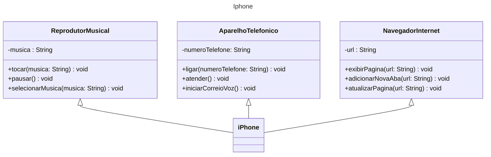

# dio-modelando-iphone
Desafio de projeto para a trilha de java básico - dio

```mermaid
---
title: Iphone
---
classDiagram
    ReprodutorMusical
    AparelhoTelefonico
    NavegadorInternet
    ReprodutorMusical <|-- iPhone
    AparelhoTelefonico <|-- iPhone
    NavegadorInternet <|-- iPhone
    class iPhone{
    }
    class ReprodutorMusical{
        -musica : String

        +tocar(musica: String) void
        +pausar() void
        +selecionarMusica(musica: String) void
    }
    class AparelhoTelefonico{
        -numeroTelefone: String
        +ligar(numeroTelefone: String) void
        +atender() void
        +iniciarCorreioVoz() void
    }
    class NavegadorInternet{
        -url : String
        +exibirPagina(url: String) void
        +adicionarNovaAba(url: String) void
        +atualizarPagina(url: String) void
    }
```
